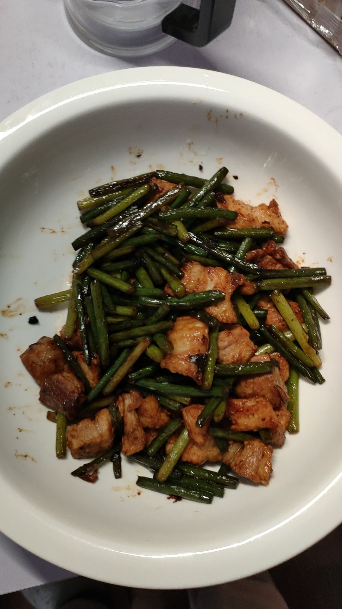

# 07-蒜薹炒肉

## 食材与调料

蒜薹、里脊肉

葱、蒜

食盐、生抽、蚝油

## 步骤

### 1.备菜

蒜薹切段(别焯水)、猪肉切片

### 2.炒菜

葱蒜炸锅

炒肉至变色

加蒜薹，加1/3勺食盐

翻炒两下，铺平煸2分钟，翻炒几下

翻面，再煸2分钟，翻炒1分钟

加1勺生抽，1勺蚝油，翻炒1分钟

出锅

## 备注

做这个菜的时候蒜薹别焯水(焯水过后蒜薹一咬里面会出水)

煸之前可以多放点油

别放老抽，不然颜色太深了