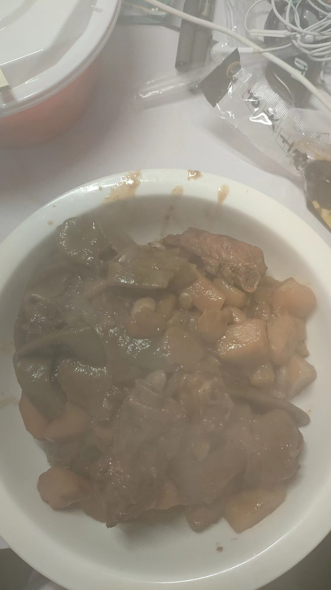

# 08-豆角土豆排骨

## 食材与调料

豆角、2-3土豆、排骨

姜、蒜、大料

料酒、生抽、老抽、蚝油、黄豆酱、食盐

## 步骤

### 1.备菜

摘豆角、土豆切块

冷水下锅排骨、姜片、料酒，大火煮开

### 2.炒排骨

姜蒜炸锅

下排骨，两面煸炒至微微焦黄

加2勺生抽、几滴老抽、1勺蚝油、1勺黄豆酱、1个大料、一大碗水

大火煮5分钟

### 3.炖菜

下入土豆、豆角小火炖1小时

加1满勺盐、半勺白糖

水多就开盖炖，水少就填汤

最后大火收汁，出锅

## 备注

炸锅的时候油热转小火

煸的时候一定也是小火，否则加完调料全糊锅了

大料一定少放，否则会发苦

水多了就开盖炖，水少就填汤然后盖盖炖