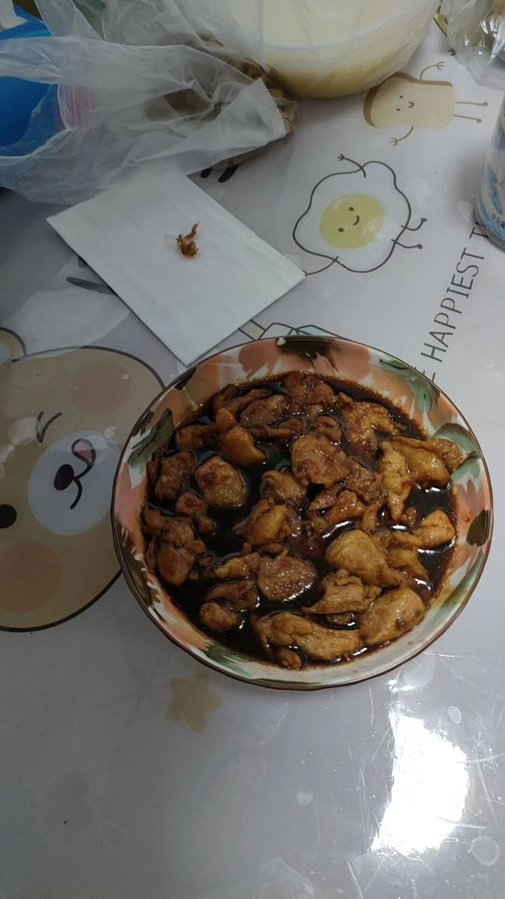

# 13-照烧鸡肉

## 食材与调料

琵琶腿 1.5斤

蒜

料酒 食盐 胡椒粉 生抽 老抽 蚝油 蜂蜜

## 步骤

### 1. 备菜

琵琶腿去骨、去皮 切成小块

清水泡洗、投净

1勺蒜蓉、1勺料酒、半勺食盐、半勺胡椒粉 抓匀 

腌制20分钟

准备料汁：1勺料酒、1勺生抽、1勺蚝油、1勺蜂蜜、1勺老抽、小半碗清水、半勺淀粉搅匀

### 2. 做菜

热油，煎鸡肉至两面金黄

把油倒出锅，再倒入料汁

中小火炖开锅，收汁

出锅，把料汁淋到鸡肉上

## 备注

1.一定要放1勺老抽，不然颜色太浅

2.尽量收汁，如果料汁太多那就先出锅鸡肉然后少淋点料汁
