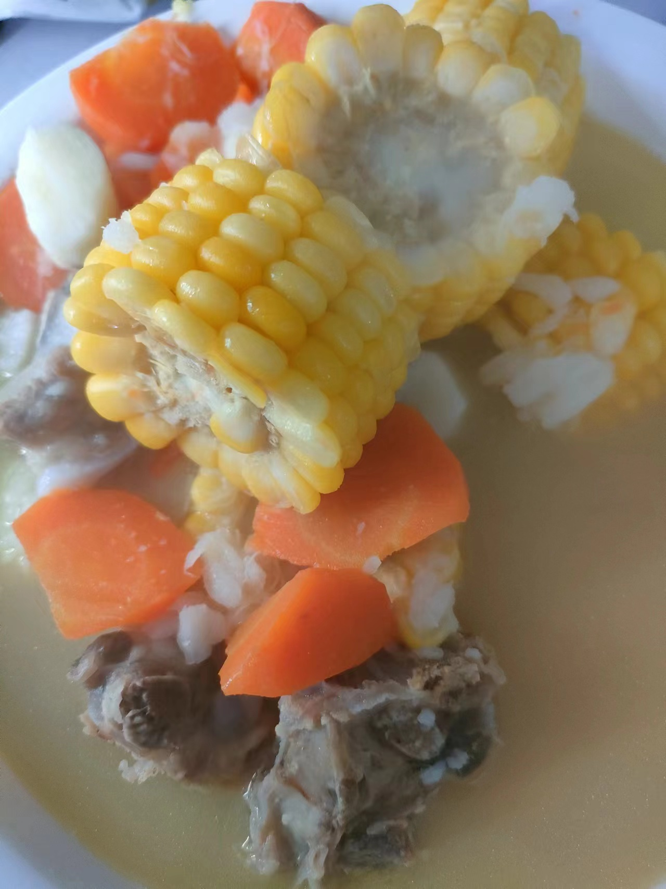

# 04-玉米山药排骨汤

## 食材与调料

甜玉米1岁 胡萝卜1根 山药3节 排骨8-10块

葱 姜 

料酒 盐

## 步骤

### 1. 备菜

排骨冷水下锅， 加葱段 姜片 料酒 焯水

撇净浮沫 捞出备用

玉米切段、胡萝卜、山药切块

### 2.炖汤

热油煎排骨，至两面金黄

加一碗半汤碗开水，加入玉米、胡萝卜，1勺食盐

小火炖30分钟

加入山药， 继续炖10分钟

出锅

## 备注

山药要最后放，时间太长就炖碎了

煎完排骨可以把油倒出来一些
