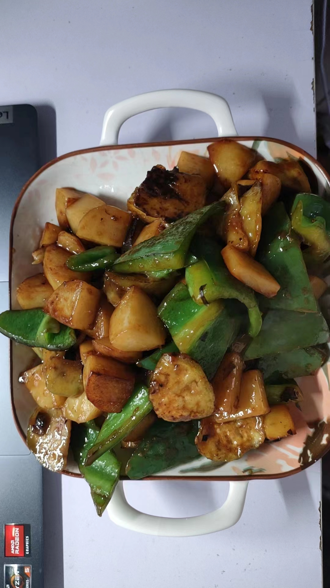

# 00-模板

## 食材与调料

茄子、土豆、大辣椒

葱、蒜

生抽、老抽、蚝油、白糖、食盐、淀粉

## 步骤

### 1.备菜

土豆、茄子切块，大辣椒切片

茄子切块后裹满淀粉搅拌均匀

准备调料汁，两勺生抽、两滴老抽、一勺蚝油、半勺白糖少量盐，一勺淀粉半碗水

### 2. 煎菜

土豆需要先焯水

然后稍微多放些油来**煎**土豆(放到油锅中煎差不多再翻面)，土豆可以尝试多放几块煎。

然后煎茄子块(要一块两块这么煎，一下都放进去油就全都被吸走了)

### 3.炒菜

葱、蒜炸锅然后炒大辣椒。

放调料汁然后放土豆茄子块，爆炒到黏糊

## 备注

土豆先焯水弄熟，今天这个明显土豆没煎熟

茄子注意要一块两块煎，不然一下子把油全都吸收。(或者可以在煎茄子的时候多放油？)
