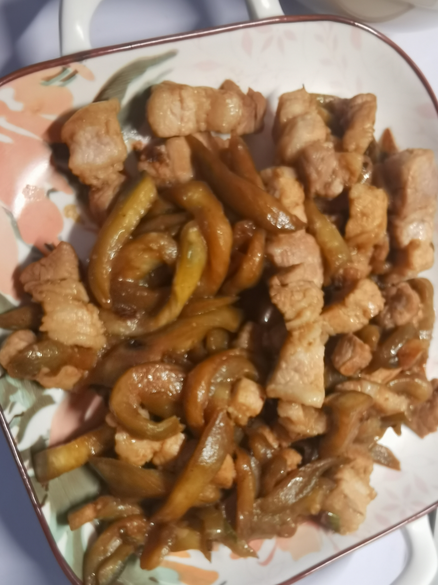

# 02-茄丝炒肉

## 食材与调料

茄子、猪肉

葱、蒜

生抽、蚝油

## 步骤

### 1. 备菜

先洗茄子，**削皮**，切丝。然后放到水中备用。(防止氧化变黑)、

茄子丝切细一点，因为茄子不会缩水太多。

洗肉(用淘米水)，切丝。

### 2.炒菜

葱蒜炸锅

炒肉，直到变色

加入茄丝，加生抽蚝油翻炒。

出锅

## 备注

肉稍微有点淡，可以在炒肉之前先腌，但是腌后变色更加不容易区分是否炒熟。

茄子切丝后别用水泡，炒出来水了吧唧的

