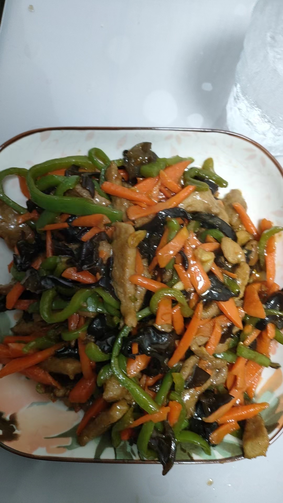

# 12-鱼香肉丝

## 食材与调料

里脊肉3两  青椒2个 胡萝卜1根 木耳2两

葱 蒜

盐、生抽、醋、糖、料酒、淀粉、豆瓣酱

## 步骤

### 1.备菜

青椒、胡萝卜切丝，木耳切丝

焯水

里脊切丝，1勺盐、1勺生抽、一勺料酒抓匀腌制

准备2勺生抽、2勺醋、1勺蚝油、1勺糖、半勺淀粉搅匀

### 2.炒菜

热锅凉油炒肉，炒熟后盛出备用

葱蒜炸锅，加1勺豆瓣酱

加肉丝、青椒丝、胡萝卜丝炒匀

加入木耳，倒入酱汁翻炒出锅

## 备注

不喜欢木耳可以不放

胡萝卜丝可以直接插